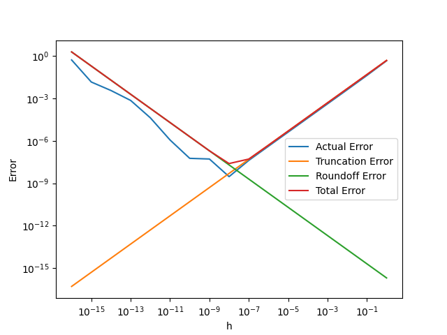

# 数值分析实验报告

> 姓名：郑友捷		学号：2021010771		班级：计14

## 实验 1

### 上机题 1

图例为

### 上机题 3

#### 1

依据代码中`LAB1.py:Subject3`函数输出，n 为 2097152。

理论分析：实际所需的 n 不仅和单精度浮点数的机器精度有关，还和参与计算的数目有关。无穷级数计算时值约在 10 - 20 之间，因此整数部分有 2 位。已知单精度浮点数的机器精度为 $\varepsilon=5.960*10^{-8}$，则实际所需的 $\frac{1}{n}$只要不超过 $10 \varepsilon \approx 5.960*10^{-7}$便有可能使得无穷级数结果不发生改变。而 $\frac{1}{2097152} = 4.77*10^{-7}$满足如上要求。

#### 2

单精度的计算值为`15.403683`，双精度的计算值为`15.133306695078193`。由于单精度存在较大的舍入误差，因此精度较低时计算误差较大，可能是由于四舍五入向上舍入导致的。

#### 3

双精度浮点数的机器精度为$\varepsilon = 1.1 * 10^{-16}$，依据上述分析，需要 $\frac{1}{n} \le 1.1 * 10^{-15}$，则 n 为 $10^{15}$ 的数量级的数目。在本机上若认为 1s 可以运行 $10^9$ 次运算，将一次无穷级数的计算视为一次运算（实际上这个运算包括了很多部分，如赋值、除法和加法，可能远大于一次运算的时间），也至少需要 $10^6s$ 才能完成运算，折合为 11 .5 天。