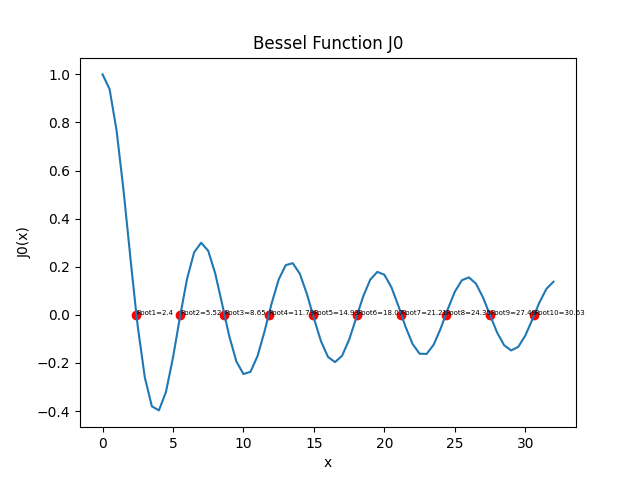

# 数值分析实验报告

> 姓名：郑友捷		学号：2021010771		班级：计14


## 实验 1

### 上机题 1

图例为


### 上机题 3

#### 1

依据代码中`LAB1.py:Subject3`函数输出，n 为 2097152。

理论分析：实际所需的 n 不仅和单精度浮点数的机器精度有关，还和参与计算的数目有关。无穷级数计算时值约在 10 - 20 之间，因此整数部分有 2 位。已知单精度浮点数的机器精度为 $\varepsilon=5.960*10^{-8}$，则实际所需的 $\frac{1}{n}$只要不超过 $10 \varepsilon \approx 5.960*10^{-7}$便有可能使得无穷级数结果不发生改变。而 $\frac{1}{2097152} = 4.77*10^{-7}$满足如上要求。

#### 2

单精度的计算值为`15.403683`，双精度的计算值为`15.133306695078193`。由于单精度存在较大的舍入误差，因此精度较低时计算误差较大，可能是由于四舍五入向上舍入导致的。

#### 3

双精度浮点数的机器精度为$\varepsilon = 1.1 * 10^{-16}$，依据上述分析，需要 $\frac{1}{n} \le 1.1 * 10^{-15}$，则 n 为 $10^{15}$ 的数量级的数目。在本机上若认为 1s 可以运行 $10^9$ 次运算，将一次无穷级数的计算视为一次运算（实际上这个运算包括了很多部分，如赋值、除法和加法，可能远大于一次运算的时间），也至少需要 $10^6s$ 才能完成运算，折合为 11 .5 天。


## 实验2

### 上机题 2

#### 判停规则

设定规则如下：

- 牛顿法和牛顿下山法均采用绝对误差判据，绝对误差的值不超过 $eps = 10^{-4}$ 时认为迭代停止。
- 下山因子序列为$\lambda_i = \frac{1}{i}, 1\le i \le 100$。

#### 迭代输出

- $f(x) = x^3-2x+2$，$x_0 = 0$：

  - 牛顿法的值会在 0 和 1 之间反复跳转，无法收敛。

  - 牛顿下山法输出为：

    ```sh
    Newton Downhill Method Solution:
    Iteration i: 0 val: 1.0 factor: 0
    Iteration i: 1 val: 0.6666666666666667 factor: 2
    Iteration i: 2 val: 0.9555555555555557 factor: 4
    Iteration i: 3 val: 0.6954590662807099 factor: 4
    Iteration i: 4 val: 0.9107214926694919 factor: 7
    Iteration i: 5 val: 0.7194384973009318 factor: 9
    Iteration i: 6 val: 0.9091943082007318 factor: 10
    Iteration i: 7 val: 0.7324194130656657 factor: 10
    Iteration i: 8 val: 0.8907836449203064 factor: 14
    Iteration i: 9 val: 0.7477368272741158 factor: 16
    Iteration i: 10 val: 0.8777031123926639 factor: 21
    Iteration i: 11 val: 0.7543801846642958 factor: 23
    Iteration i: 12 val: 0.8753297048196879 factor: 25
    Iteration i: 13 val: 0.7568278881931725 factor: 25
    Iteration i: 14 val: 0.8734742649010313 factor: 27
    Iteration i: 15 val: 0.7597962061205652 factor: 27
    Iteration i: 16 val: 0.8703628636586971 factor: 30
    Iteration i: 17 val: 0.7616581611396119 factor: 30
    Iteration i: 18 val: 0.8688663576470561 factor: 32
    Iteration i: 19 val: 0.7637845139237078 factor: 32
    Iteration i: 20 val: 0.8658251943456007 factor: 35
    Iteration i: 21 val: 0.7662304446680113 factor: 36
    Iteration i: 22 val: 0.8647883214520523 factor: 38
    Iteration i: 23 val: 0.7682396129755165 factor: 38
    Iteration i: 24 val: 0.8633983128067998 factor: 41
    Iteration i: 25 val: 0.7687936758753368 factor: 40
    Iteration i: 26 val: 0.8627731149072959 factor: 42
    Iteration i: 27 val: 0.7713306314636619 factor: 42
    Iteration i: 28 val: 0.8600530994986121 factor: 47
    Iteration i: 29 val: 0.7729375949945113 factor: 47
    Iteration i: 30 val: 0.8577392862417624 factor: 51
    Iteration i: 31 val: 0.7758899990478173 factor: 53
    Iteration i: 32 val: 0.8558642063981929 factor: 58
    Iteration i: 33 val: 0.7773277600154082 factor: 58
    Iteration i: 34 val: 0.854880175181542 factor: 62
    Iteration i: 35 val: 0.7781988327775899 factor: 61
    Iteration i: 36 val: 0.8538551705686312 factor: 65
    Iteration i: 37 val: 0.7786760459803153 factor: 64
    Iteration i: 38 val: 0.8530044334194106 factor: 67
    Iteration i: 39 val: -1.6480971164406544 factor: 1
    Iteration i: 40 val: -1.7813930664255342 factor: 0
    Iteration i: 41 val: -1.7693961777512017 factor: 0
    Iteration i: 42 val: -1.7692923619787992 factor: 0
    Iteration i: 43 val: -1.7692923542386314 factor: 0
    Answer X:  -1.7692923542386314
    ```

- $g(x) = -x^3 + 5x$，$x_0 = 1.35$

  - 牛顿法输出为：

    ```sh
    Newton Method Solution:
    Iteration i: 0 val: 10.525668449197836
    Iteration i: 1 val: 7.124286625588786
    Iteration i: 2 val: 4.910780653019383
    Iteration i: 3 val: 3.516911305892172
    Iteration i: 4 val: 2.7097430061997922
    Iteration i: 5 val: 2.3369400314687754
    Iteration i: 6 val: 2.2422442539928538
    Iteration i: 7 val: 2.2360934030219455
    Answer X:  2.236067977933435
    ```

  - 牛顿下山法输出为：

    ```sh
    Newton Downhill Method Solution:
    Iteration i: 0 val: 2.4969585561497296 factor: 7
    Iteration i: 1 val: 2.2719762055269577 factor: 0
    Iteration i: 2 val: 2.2369017057503537 factor: 0
    Iteration i: 3 val: 2.236068443383608 factor: 0
    Iteration i: 4 val: 2.2360679774999355 factor: 0
    Answer X:  2.2360679774999355
    ```

#### 标准方法

采用如下方法得到较为准确的解：

```python
def std_answer():
    import scipy
    from scipy.optimize import fsolve

    # 之所以起始为 - 1，是为了能够收敛
    print(fsolve(f, -1, fprime=f_prime))

    # 求解 g(x) = 0 的解
    print(fsolve(g, 1.35))
```

其中`fsolve(f)`起始值为 -1 是为了能够收敛到正确的解。

输出的值为 -1.76929235 和 2.23606798，和上述的解法得到的答案基本一致


#### 总结

第一个问题使用牛顿法会导致在$x_0 = 0$时无法收敛，因此必须使用牛顿下山法才能正确收敛。而第二个问题两种方法均可，但牛顿下山法收敛较快。


### 上机题3

实现算法详见代码，求解得到的零点为：

```sh
Root 1 2.404832182964805
Root 2 5.520081011064856
Root 3 8.65375249240065
Root 4 11.791516733685071
Root 5 14.930920199511286
Root 6 18.071067106589922
Root 7 21.21163131374756
Root 8 24.352476286058735
Root 9 27.493271578050088
Root 10 30.634604402189805
```

绘制图形为：



