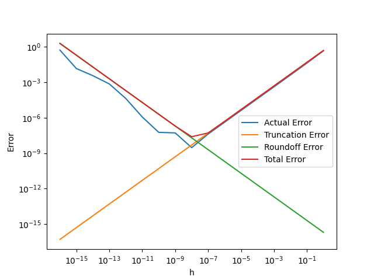

# LAB 1 数值计算导论

> 姓名：郑友捷		班级：计 14		学号：2021010771


## 上机题 1

### 实验思路

大致按照教材给出公式即可进行绘图：

- 差商 $f'(x) = (f(x+h) - f(x)) / h$

- 截断误差为 $M * h / 2, M = max|f''(x)|, x = 1$，这里取 $M = 1$
- 舍入误差为 $2 * u / h$, $u$ 为一次计算误差，设置为 $1e-16$
- 总误差限 = 截断误差 + 舍入误差

### 实验代码

```python
def Subject1():
    # 枚举不同的 h，计算差商误差、总误差限、截断误差和舍入误差
    h_list = [1e-16, 1e-15, 1e-14, 1e-13, 1e-12, 1e-11, 1e-10, 1e-9, 1e-8, 1e-7, 1e-6, 1e-5, 1e-4, 1e-3, 1e-2, 1e-1, 1]

    x = 1

    f = numpy.sin
    f_prime = numpy.cos

    f_prime_diff = numpy.zeros(len(h_list))
    f_truncation_diff = numpy.zeros(len(h_list))
    f_roundoff_diff = numpy.zeros(len(h_list))
    f_total_diff = numpy.zeros(len(h_list))

    for i in range(len(h_list)):
        h = h_list[i]
        f_prime_diff[i] = abs((f(x+h) - f(x)) / h - f_prime(x))
        f_truncation_diff[i] = h / 2
        f_roundoff_diff[i] = 2 * 1e-16 / h
        f_total_diff[i] = f_truncation_diff[i] + f_roundoff_diff[i]

    # 绘制差商误差、总误差限、截断误差和舍入误差四个变量和步长 h 的关系图
    # 四条曲线在同一张图上绘制

    plt.plot(h_list, f_prime_diff, label='Actual Error')
    plt.plot(h_list, f_truncation_diff, label='Truncation Error')
    plt.plot(h_list, f_roundoff_diff, label='Roundoff Error')
    plt.plot(h_list, f_total_diff, label='Total Error')
    plt.xscale('log')
    plt.yscale('log')
    plt.xlabel('h')
    plt.ylabel('Error')
    plt.legend()
    # plt.show()
    plt.savefig('./figures/LAB1.png')

```

### 实验结果




### 实验分析

根据推导的结果可以看出，当步长变大时，截断误差对结果的影响会逐渐明显，而舍入误差对结果的影响会慢慢变弱。


## 上机题 3

### 1：单精度浮点数

#### 实验代码

```python
# 使用单精度浮点数计算无穷级数
ans_32 = numpy.float32(0)
# 计算无穷级数，并且判断当 n 等于几时，无穷级数的和不再变化
n = 1
while True:
    temp_ans = ans_32 + numpy.float32(1 / n)
    if ans_32 == temp_ans:
        break
        ans_32 = temp_ans
        n += 1
print("单精度所用次数: {} ".format(n))
print("单精度答案:")
print(ans_32)
```


#### 实验输出

```sh
单精度所用次数: 2097152
单精度答案: 15.403683
```

#### 实验分析

实际所需的 n 不仅和单精度浮点数的机器精度有关，还和参与计算的数目有关。当 n 趋于无穷时，浮点数体系下无穷级数计算时值约在 10 - 20 之间，因此整数部分有 2 位。已知单精度浮点数的机器精度为 $\varepsilon=5.960*10^{-8}$，则实际所需的 $\frac{1}{n}$只要不超过 $10 \varepsilon \approx 5.960*10^{-7}$便有可能使得无穷级数结果不发生改变。而 $\frac{1}{2097152} = 4.77*10^{-7}$满足如上要求。

### 2

使用双精度浮点数运行上述程序，单精度的计算值为`15.403683`，双精度的计算值为`15.133306695078193`。由于单精度存在较大的舍入误差，因此精度较低时计算误差较大，可能是由于四舍五入向上舍入导致的。

### 3

双精度浮点数的机器精度为$\varepsilon = 1.1 * 10^{-16}$，依据上述分析，需要 $\frac{1}{n} \le 1.1 * 10^{-15}$，则 n 为 $10^{15}$ 的数量级的数目。在本机上若认为 1s 可以运行 $10^9$ 次运算，将一次无穷级数的计算视为一次运算（实际上这个运算包括了很多部分，如赋值、除法和加法，可能远大于一次运算的时间），也至少需要 $10^6s$ 才能完成运算，折合为 11 .5 天。


