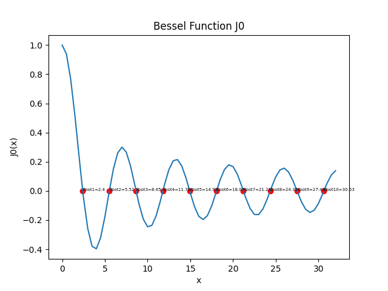

# LAB 2 非线性方程求根

> 姓名：郑友捷		学号：2021010771		班级：计 14

## 上机题 2

### 实验思路

设定规则如下：

- 牛顿法和牛顿下山法均采用绝对误差判据，绝对误差的值不超过 $eps = 10^{-4}$ 时认为迭代停止。

- 下山因子序列为$\lambda_i = \frac{1}{i}, 1\le i \le 100$。


### 实验代码

#### 牛顿迭代法

```python
def Newton(f, df, x0, eps):
    xk = x0
    ans = []
    # 如果超过 1000000 次迭代，认为无法收敛
    Num = 1000000
    while True:
        x_k1 = xk - f(xk) / df(xk)
        if abs(x_k1 - xk) < eps:
            break
        ans.append(x_k1)
        if len(ans) > Num:
            print("Error: Newton Method failed to converge")
            return None
        xk = x_k1
    print("Newton Method Solution:")
    for index, i in enumerate(ans):
        print("Iteration i: {} val: {}".format(index, i))

    return x_k1
```

#### 牛顿下山法

```python
# 牛顿下山因子，认为有 100 项
NewtonDownhillFactor = [1/x for x in range(1, 101)]

def NewtonDownhill(f, df, x0, eps):
    xk = x0
    ans = []
    while True:
        factor_index = 0
        s = f(xk) / df(xk)
        x_k1 = xk - s
        while (abs(f(x_k1)) >= abs(f(xk))):
            factor_index += 1
            if (factor_index >= 100):
                print("Error: Newton Downhill Method failed to converge")
                return None
            x_k1 = xk - s * NewtonDownhillFactor[factor_index]
        ans.append((x_k1, factor_index))
        
        if abs(x_k1 - xk) < eps:
            break
        xk = x_k1
    print("Newton Downhill Method Solution:")
    for index, i in enumerate(ans):
        print("Iteration i: {} val: {} factor: {}".format(index, i[0], i[1]) )
    return x_k1
```


### 实验结果


- $f(x) = x^3-2x+2$，$x_0 = 0$：

  - 牛顿法的值会在 0 和 1 之间反复跳转，无法收敛。

  - 牛顿下山法输出为：

    ```sh
    Newton Downhill Method Solution:
    Iteration i: 0 val: 1.0 factor: 0
    Iteration i: 1 val: 0.6666666666666667 factor: 2
    Iteration i: 2 val: 0.9555555555555557 factor: 4
    Iteration i: 3 val: 0.6954590662807099 factor: 4
    Iteration i: 4 val: 0.9107214926694919 factor: 7
    Iteration i: 5 val: 0.7194384973009318 factor: 9
    Iteration i: 6 val: 0.9091943082007318 factor: 10
    Iteration i: 7 val: 0.7324194130656657 factor: 10
    Iteration i: 8 val: 0.8907836449203064 factor: 14
    Iteration i: 9 val: 0.7477368272741158 factor: 16
    Iteration i: 10 val: 0.8777031123926639 factor: 21
    Iteration i: 11 val: 0.7543801846642958 factor: 23
    Iteration i: 12 val: 0.8753297048196879 factor: 25
    Iteration i: 13 val: 0.7568278881931725 factor: 25
    Iteration i: 14 val: 0.8734742649010313 factor: 27
    Iteration i: 15 val: 0.7597962061205652 factor: 27
    Iteration i: 16 val: 0.8703628636586971 factor: 30
    Iteration i: 17 val: 0.7616581611396119 factor: 30
    Iteration i: 18 val: 0.8688663576470561 factor: 32
    Iteration i: 19 val: 0.7637845139237078 factor: 32
    Iteration i: 20 val: 0.8658251943456007 factor: 35
    Iteration i: 21 val: 0.7662304446680113 factor: 36
    Iteration i: 22 val: 0.8647883214520523 factor: 38
    Iteration i: 23 val: 0.7682396129755165 factor: 38
    Iteration i: 24 val: 0.8633983128067998 factor: 41
    Iteration i: 25 val: 0.7687936758753368 factor: 40
    Iteration i: 26 val: 0.8627731149072959 factor: 42
    Iteration i: 27 val: 0.7713306314636619 factor: 42
    Iteration i: 28 val: 0.8600530994986121 factor: 47
    Iteration i: 29 val: 0.7729375949945113 factor: 47
    Iteration i: 30 val: 0.8577392862417624 factor: 51
    Iteration i: 31 val: 0.7758899990478173 factor: 53
    Iteration i: 32 val: 0.8558642063981929 factor: 58
    Iteration i: 33 val: 0.7773277600154082 factor: 58
    Iteration i: 34 val: 0.854880175181542 factor: 62
    Iteration i: 35 val: 0.7781988327775899 factor: 61
    Iteration i: 36 val: 0.8538551705686312 factor: 65
    Iteration i: 37 val: 0.7786760459803153 factor: 64
    Iteration i: 38 val: 0.8530044334194106 factor: 67
    Iteration i: 39 val: -1.6480971164406544 factor: 1
    Iteration i: 40 val: -1.7813930664255342 factor: 0
    Iteration i: 41 val: -1.7693961777512017 factor: 0
    Iteration i: 42 val: -1.7692923619787992 factor: 0
    Iteration i: 43 val: -1.7692923542386314 factor: 0
    Answer X:  -1.7692923542386314
    ```

- $g(x) = -x^3 + 5x$，$x_0 = 1.35$

  - 牛顿法输出为：

    ```sh
    Newton Method Solution:
    Iteration i: 0 val: 10.525668449197836
    Iteration i: 1 val: 7.124286625588786
    Iteration i: 2 val: 4.910780653019383
    Iteration i: 3 val: 3.516911305892172
    Iteration i: 4 val: 2.7097430061997922
    Iteration i: 5 val: 2.3369400314687754
    Iteration i: 6 val: 2.2422442539928538
    Iteration i: 7 val: 2.2360934030219455
    Answer X:  2.236067977933435
    ```

  - 牛顿下山法输出为：

    ```sh
    Newton Downhill Method Solution:
    Iteration i: 0 val: 2.4969585561497296 factor: 7
    Iteration i: 1 val: 2.2719762055269577 factor: 0
    Iteration i: 2 val: 2.2369017057503537 factor: 0
    Iteration i: 3 val: 2.236068443383608 factor: 0
    Iteration i: 4 val: 2.2360679774999355 factor: 0
    Answer X:  2.2360679774999355
    ```


### 标准方法

采用如下方法得到较为准确的解：

```python
def std_answer():
    import scipy
    from scipy.optimize import fsolve

    # 之所以起始为 - 1，是为了能够收敛
    print(fsolve(f, -1, fprime=f_prime))

    # 求解 g(x) = 0 的解
    print(fsolve(g, 1.35))
```

其中`fsolve(f)`起始值为 -1 是为了能够收敛到正确的解。

输出的值为 -1.76929235 和 2.23606798，和上述的解法得到的答案基本一致


### 总结

牛顿迭代法虽然实现方便，但是当函数性质不好或者起始点位置不好时，可能会出现无法收敛的情况。

第一个问题使用牛顿法会导致在$x_0 = 0$时无法收敛，因此必须使用牛顿下山法才能正确收敛。

第二个问题两种方法均可，但牛顿下山法收敛较快。


## 上机题 3

### 实验思路

- fzerotx 程序按照课本给出的伪代码进行对照实现即可
- fzerotx 程序需要给出初始化的零点区间。因此在求解第一类的零阶贝塞尔函数的时候，需要先根据已有函数二分出前 10 个正零点的大致区间，并逐一传给 fzerotx 程序进行求解。

### 实验代码

fzerotx 算法实现如下：

```python
fzero_eps = 1e-5
def fzerotx(f, a, b):
    fa = f(a)
    fb = f(b)
    if (fa * fb > 0):
        print("Error: f(a) * f(b) > 0")
        return None
    c = a
    fc = fa
    d = b - c
    e = d
    while (fb != 0):
        if (fa * fb > 0):
            a = c
            fa = fc
            d = b - c
            e = d
        if (abs(fa) < abs(fb)):
            c = b
            b = a
            a = c
            fc = fb
            fb = fa
            fa = fc
        m = 0.5 * (a - b)
        tol = 2.0 * fzero_eps * max(abs(b), 1.0)
        if (abs(m) <= tol or fb == 0):
            break
        if (abs(e) < tol or abs(fc) <= abs(fb)):
            d = m
            e = m
        else:
            s = fb / fc
            if (a == c):
                p = 2.0 * m * s
                q = 1.0 - s
            else:
                q = fc / fa
                r = fb / fa
                p = s * (2.0 * m * q * (q - r) - (b - c) * (r - 1.0))
                q = (q - 1.0) * (r - 1.0) * (s - 1.0)
            if (p > 0):
                q = -q
            p = abs(p)
            if (2.0 * p < 3.0 * m * q - abs(tol * q) and p < abs(0.5 * e * q)):
                e = d
                d = p / q
            else:
                d = m
                e = m
        c = b
        fc = fb
        if (abs(d) > tol):
            b += d
        else:
            b += tol if m > 0 else -tol
        fb = f(b)
    return b
```


求解 bessel 函数零点代码：

```python
def getRootForBessel():
    import scipy
    from scipy.special import jv
    # 第一类的零阶贝塞尔函数
    f = lambda x: jv(0, x)

    # 求其前 10 个正的零点
    root_range = [(2.0,2.5),(5.5,6.0),(8.5,9.0),(11.5,12.0),(14.5,15.0),(18.0,18.5),(21.0,21.5),(24.0,24.5),(27.0,27.5),(30.5,31.0)]

    answer = []
    for i in range(10):
        print("Root", i+1, end=' ')
        val = fzerotx(f, root_range[i][0], root_range[i][1])
        print(val)
        answer.append(val)

    # 绘制 bessel 曲线，同时标记这十个零点
    import numpy
    import matplotlib.pyplot as plt
    # x 需要加入这十个零点
    # 0 到 32 取 0, 0.5, 1, 1.5 等类型，共 65 个点
    answer_index = 0
    x = []
    slot_index = []
    for i in range(65):
        x.append(i * 0.5)
        if (answer_index < 10 and i * 0.5 < answer[answer_index] and (i+1) * 0.5 >= answer[answer_index]):
            slot_index.append(len(x))
            x.append(answer[answer_index])
            answer_index += 1
    x = numpy.array(x)
    y = jv(0, x)
    plt.plot(x, y)
    plt.scatter(answer, [0]*10, color='red')
    for i in range(10):
        plt.text(answer[i], 0, f"Root{i+1}={round(x[slot_index[i]],2)}", fontsize=5)
    plt.xlabel('x')
    plt.ylabel('J0(x)')
    plt.title('Bessel Function J0')
    plt.savefig('./figures/LAB2.png')
    # plt.show()
```


### 实验结果

bessel 曲线和对应零点位置见下图：




